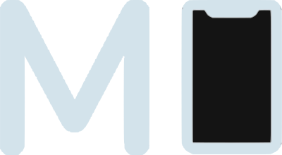
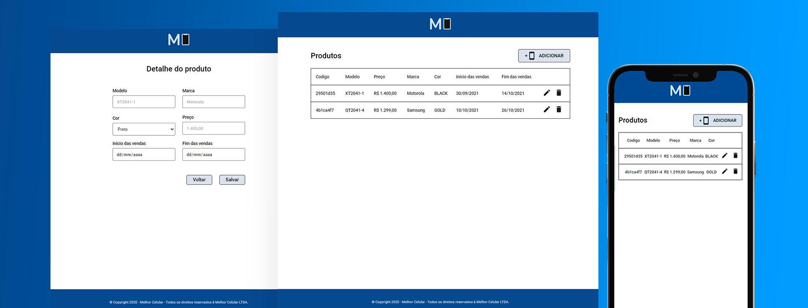

<p align="center">
  
</p>

<h1 align="center">
    
</h1>

<br>

<p align="center">
  <a href="https://melhor-celular.netlify.app/" target="_blank">
    click here to access the deploy
  </a>
</p>

## 💻 Project

Melhor-celular is a responsive site to manage cell phone records

<br>

## 🧪 Technologies

This project was developed with the following technologies:

- [Reactjs](https://reactjs.org)
- [Sass](https://sass-lang.com)

## 🚀 How to run

To start it, follow the steps below:
```bash
# Install dependencies
$ yarn

# Start the project
$ yarn start
```

<br>

Made with 💜 by Rafael Almendra 👋 [See my linkedin](https://www.linkedin.com/in/rafaelalmendradev/)
